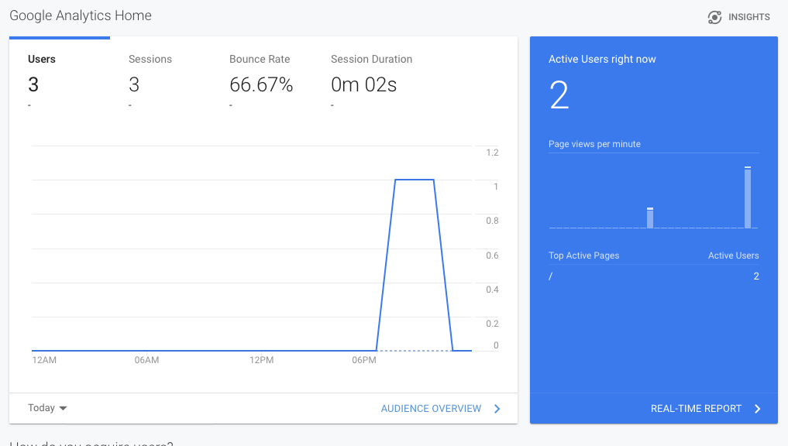
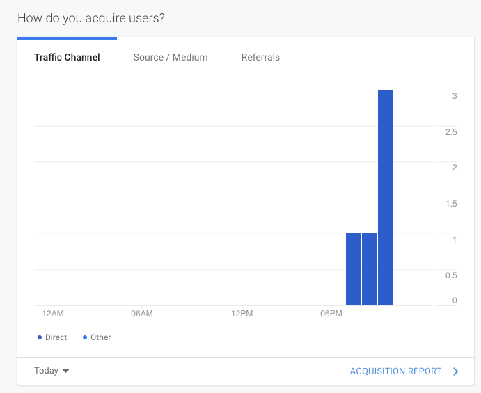
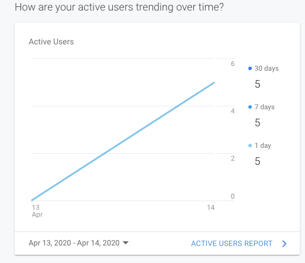
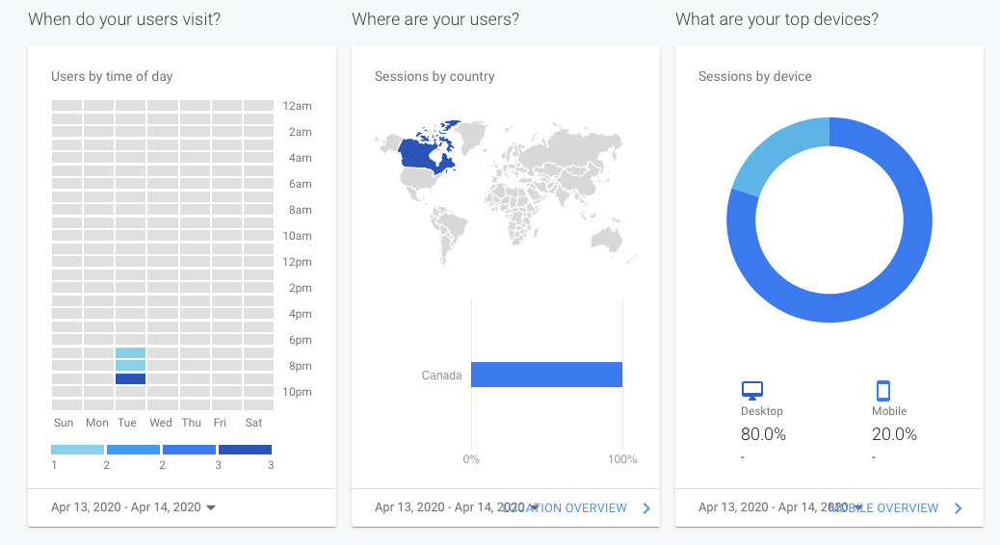
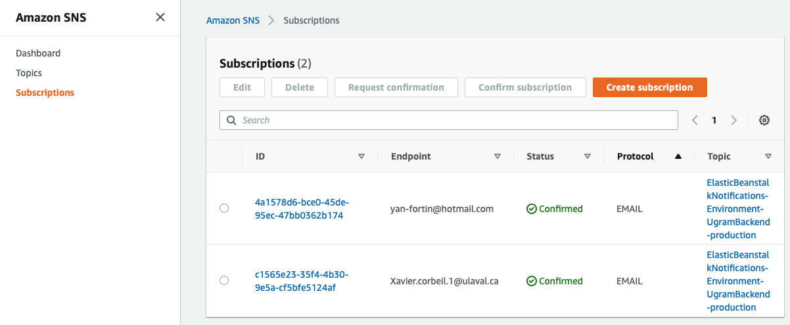

# UGram

https://github.com/GLO3112/ugram

Production: http://ugram-production-front.s3-website.ca-central-1.amazonaws.com

Staging: http://ugram-3112-0.s3-website.ca-central-1.amazonaws.com

# Analytics

Google Analytics has been setup. Many metrics are evaluated, as seen in these images:







# Monitoring

If our production version of our backend has some problem, two of our team members will receive an email containing a report.




# Run in production

  ```docker-compose -f docker-compose-prod.yaml up --build -d```
 
To stop the containers run the following:
  ```docker-compose -f docker-compose-prod.yaml down -v --rmi local```
  
cient will be available at port 3001.
  
# Run in development
  
  ```docker-compose build && docker-compose up -d```
  
To stop the containers run the following:
  ```docker-compose down```
  
client will be available at port 3001.

# Frontend

### Typescript, Sass

### React, Redux, Jest

### Librairie de tests suivra les méthodes montrées dans le cours

# Backend

### Typescript

### NestJS, TypeORM, Jest

### PostgreSQL

# Infrastructure

### CircleCI

### Github Actions

### Déploiement suivra les méthodes montrées dans le cours
